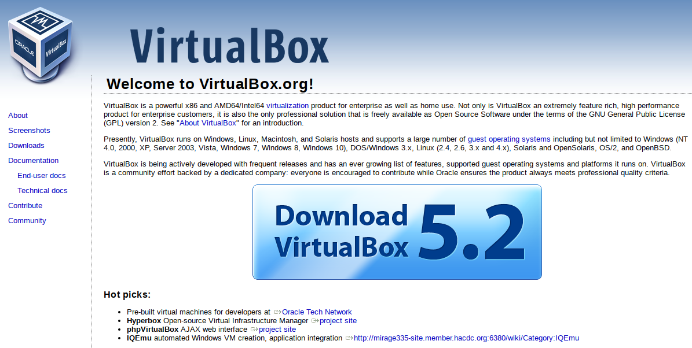

# INSTALLATION OF COURSE SOFTWARE

## OVERVIEW

In this course, we will seek to use a common analysis stack to facilitate deployment of the 
necessary tools and increase the probability that technical questions that do arise have wide
application across students.  With this in mind, we are using the following tools: 

1. [VirtualBox](https://www.virtualbox.org) is a virtualization product that will allow us all to 
use the same operating system, no matter what operating system (e.g. Windows, OSX, Linux, etc.)
you use.  (Well, if you wrote your own operating system, you may be out of luck.)

2. [Ubuntu](https://www.ubuntu.com) is an open-source operating system, specifically of the Linux
variety. The advantages of Ubuntu (and 
[Linux distributions](https://en.wikipedia.org/wiki/Linux_distribution) in general) are many.  For
our purposes, however, it is helpful that they are unix-based, which is the development environment
used for many of the tools we will employ. The upshot is that installations can go more smoothly in
many cases. (Note that OSX is similar under the hood, and can often leverage similar benefits.)
Secondly, and this is important, linux distributions *tend to be free*. Ubuntu, specifically, is a
user-friendly environment that retains similar functionality to Windows and Mac environments, while
also providing access to the robust suite of Linux utilities.

3. [Vagrant](https://www.vagrantup.com) is a tool that eases the set up of development environments.
For our purposes, it will work in concert with VirtualBox to help students easily install all of the
analytic software and utilities we will use in this course. Students will need to install VirtualBox
and Vagrant, the latter will handle acquisition of the Ubuntu OS image (that is, a file that holds the Ubuntu
OS). Upon doing so, the `Vagrantfile` we provide will execute steps that 1) set up the virtual
environment, 2) install Ubuntu, and 3) install all of the analytic software we will use this
semester.

These tools will be new to most of you, but they help us [construct a reproducible analytic
environment](https://medium.com/@JohnFoderaro/how-to-set-up-a-local-linux-environment-with-vagrant-163f0ba4da77).
One of the key objectives of this course is to introduce you to tools and workflow that allow you to
both recreate analysis and transparently share what you have done with others.  In so doing, we
reduce ambiguity around the choices we have made and, thereby, either bolster our conclusions or
efficiently identify opportunities for improvement.

## ACQUISITION OF INSTALLATION MEDIA

Installation of VirtualBox and Vagrant in Windows and OSX environments can generally be handled by
installation wizards.  To acquire the appropriate files, students can click on the respective sites
below and find the installers in the "Downloads" section for each application site. If installation
is occurring in a linux environment, installation instructions will differ based upon the flavor of
linux used. 

## INSTALLATION OF VIRTUALBOX AND VAGRANT

The videos below provide representative walkthroughs of installation on both Windows and Mac
machines.  

### Windows

The first video focuses on installation of VirtualBox and Vagrant on Windows, but the author
actually gives a pretty solid overview of how these tools work together.  

### OSX

We have two separate videos for Mac users.  The first walks through the installation of Virtualbox
(which should come first)...

... and the second walks through installation of Vagrant.

## VIRTUAL MACHINE SET UP

Once both of these applications are installed, choose the folder you want to house all of the work
that occurs on the virtual machine. Whichever folder you choose will correspond with the
`/home/vagrant/` folder on your new virtual machine.  Use the [command
prompt](https://en.wikipedia.org/wiki/Cmd.exe) (on Windows) or the
[terminal](https://en.wikipedia.org/wiki/Terminal_(macOS)) on OSX to navigate to the location you
have chosen (in general, by submitting `cd /path/to/folder`).

Initialize a new Vagrant instance by submitting the following commands:

	`vagrant init` # To generate the default Vagrantfile
	`vagrant up`   # To spin up the actual virtual machine

This will create a whole new virtual machine! Don't get too excited yet, because it is not the machine we will actually use.
However, you should see a window open with a command line interface. Log into the machine (both the
user name and password are 'vagrant').  You are now in a fully functioning Linux environment that is
integrated with your own file system at particular points. Initially, the only point of overlap is
the `/vagrant/` directory.  To prove this to yourself, issue the following commands from the command 
line inside your guest machine (the virtual machine):

	`cd /vagrant`
	`echo abc123 > test`

Then go back to your host machine (your regular operating system) and navigate to the folder in
which you initialized the vagrant instance.  You should see not only the Vagrantfile used to create
this virtual machine instance, but also the text file (`test`) you just created! If you would like
to have more points of overlap, you can do so by leveraging ["synced
folders"](https://www.vagrantup.com/docs/synced-folders/).

In setting up our environment, we will also need to use the VirtualBox manager. If you run the
VirtualBox application on your host machine, you should see the currently running instance of the virtual machine you
just created in the list on the left-hand side.  Leave this manager open, because we will come back
to it.

On your host machine, you can power down the virtual machine by submitting `vagrant halt` in the
same directory you used to initialize the virtual machine.
Since we do not want to use the defualt VM, you can go ahead and destroy that machine with `vagrant
destroy`. The actual
[Vagrantfile](https://github.com/choct155/telling_stories_with_data/blob/master/Vagrantfile) we will
use for this class is located on [Github](https://github.com/). Replace the current Vagrantfile on
your host machine with the one on the other end of the above link. This new Vagrantfile points to
Ubuntu 17.10 and will enable the use of a Graphical User Interface from within Virtualbox. Once the
new Vagrantfile is in place, run `vagrant up` again to start your new machine. Initially, you will
still see only a command line environment. Sign in again with 'vagrant' as the user name and
password. Once you are at the command line, submit `startx` and your GUI environment should start
up. Once you have confirmed that the GUI is running, feel free to power down the VM from your host
machine with `vagrant halt`.

### SCREEN SIZE ADJUSTMENT

It turns out that adjusting screen size in a VirtualBox session requires a bit of set up. First, we
must install the [GuestAdditions](https://www.virtualbox.org/manual/ch04.html) module on the *guest*
machine. To do this, we need to grab the image file that contains the module
(`VBoxGuestAdditions_5.2.4.iso` is located [here](http://download.virtualbox.org/virtualbox/5.2.4/))
and "insert" it into our virtual machine's CD-ROM drive. 

You might ask yourself, how does a computer
that consists entirely of software have a CD-ROM drive? In reality, we are dealing with a virtual
version of such a drive, and our base box does not come with said virtual drive. To add one, go to
the VirtualBox manager (your VM must be powered down). Making sure that the VM you want to modify is
selected, navigate via mouse to `Settings > Storage`. Click on the CD-looking icon next the IDE
Controller to add a new disc drive. Make sure to leave it empty, and exit the settings dialogue.

Then, navigate via mouse to `File > Preferences > Display`. Change the maximum guest screen size to
`None` and click OK. Now we have the pieces in place to install GuestAdditions on the guest machine.

Start your VM again with `vagrant up`, sign in, and start up the GUI. Your VM instance should still
be inside of a window on your host machine, and at the top you will see menu options. Navigate to
`Devices > Insert Guest Additions CD Image ...`. It may seem like nothing has happened, but in
reality, VirtualBox will reach out to the ISO location linked to above, and place the GuestAdditions
ISO in our virtual CD drive. Double-click on the `File System` icon on your guest VM and you should
see an entry under devices that looks like a CD (labeled `VBox_GAs_5.2.4`). Look inside the CD for a
file called `VBoxLinuxAdditions.run`, and drag it onto the desktop. This file is our installer.

Now, open your greatest and best friend, the [bash
shell](https://en.wikipedia.org/wiki/Bash_(Unix_shell)). It's the icon in the bottom panel that
looks kind of like a less stylish version of the image below, and it can be started by double-clicking 
on it.

After all that work to get a GUI, we are back at the command line. Submit the following commands:

	`cd /home/vagrant/Desktop` 			# Navigate to your desktop
	`chmod +x VBoxLinuxAdditions.run` 	# Make the file executable (if it wasn't already)
	`./VBoxLinuxAdditions.run`			# Run the installer

Let the installer do it's thing (confirming when and if needed) and then power down the VM with
`vagrant halt` back on the host machine. When you start the VM again, you should see a much larger
and more manageable screen.

## ADDITIONAL RESOURCES

*Note that, in general, there are numerous videos on [YouTube](https://www.youtube.com) that provide
great information about all of the tools we will be using, from applications to operating systems.
Students are strongly encouraged to use it as an informational source.*

### The Unix Shell

One of the biggest advantages of operating in a unix-based or adjacent environment is the
[shell](https://en.wikipedia.org/wiki/Unix_shell).
While it is true that Windows offers command line access, unix-based systems have generally featured
the shell as the cornerstone of interaction with the computer. This method of interacton can be far
more flexible and efficient than interaction via the [Graphical User
Interface](https://en.wikipedia.org/wiki/Graphical_user_interface) (GUI) after learning just a few
of the basic functions available. That said, I won't sugar coat it, it takes practice.  Fortunately,
[Software Carpentry](https://software-carpentry.org) has, among a host of great resources, a solid
[introduction](https://swcarpentry.github.io/shell-novice/) to the [Bourne Again
Shell](https://en.wikipedia.org/wiki/Bash_(Unix_shell)) (bash). bash is fairly ubiquitous in the
Unix space, and the syntax it employs also works in large part in OSX. Learning how to use it will
probably make your life easier. For folks that prefer a video walkthrough of features, here is a
representative video that can be found on YouTube:

